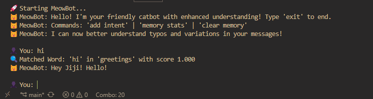
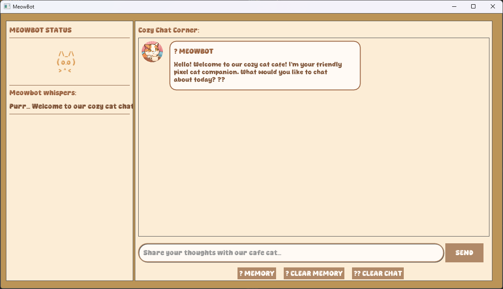

# 🐱 MeowBot
MeowBot is an interactive chatbot that can understan GenZ words
## Key Features ✨
- **Purr-sonalized Responses**: Context-aware replies with memory of user details

- **Gen Z Slang Ready**: Understands modern internet language ("slay", "no cap", "sus")

- **Typo Tolerant**: Uses fuzzy matching to understand misspelled words

- **Emotion Detection**: Analyzes sentiment in messages to respond appropriately

- **Dual Interfaces**: Choose between command-line or graphical interface

- **Customizable**: Easily add new response patterns or change the theme

## Logic behind it 🧠
- **Typo Handling**: Uses **Levenshtein distance** to correct common misspellings

- **Intent Matching**: Compares input against patterns with **fuzzy matching**

- **Sentiment Analysis**: Detects emotional tone using **Gen Z slang** dictionary

- **Context Integration**: References previous conversations for continuity

## Project Structure 🚀
### **text_processor.py**
- **Levenshtein Distance**: Measures text similarity for fuzzy matching

- **Tokenization & Stemming**: Breaks down sentences for analysis

- **Pattern Matching**: Finds closest matches to known phrases

### **sentiment_analyzer.py**
- **Gen Z Slang Dictionary**: Recognizes modern internet language

- **Emoji Analysis**: Interprets emoji sentiment values

- **Intensity Modifiers**: Detects words like "very" or "kinda"

### **data_manager.py**
- **Conversation Memory**: Stores chat history and user context

- **Intent Storage**: Manages response patterns in JSON 

- **Session Tracking**: Maintains conversation counts

### **chatbot.py**
- **Response Generation**: Combines intent matching with sentiment analysis

- **Context Awareness**: References remembered user details

- **Error Handling**: Gracefully manages unrecognized inputs

## Installation 🛠️

1. Clone the repository:
   ```bash
   git clone https://github.com/yourusername/meowbot.git
   cd meowbot
   ```

## How to Use MeowBot 🤔
### Command Line Interface
```bash
python main.py
```


### Graphical User Interface
```bash
python gui.py
```

